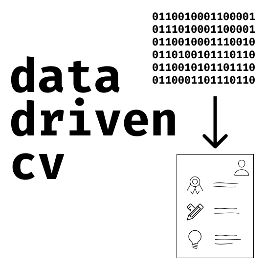
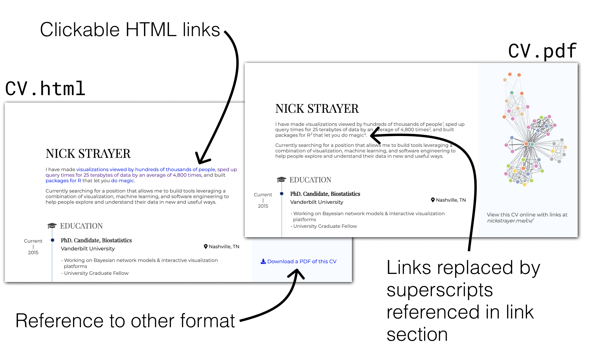

# datadrivencv 

<!-- badges: start -->

<!-- badges: end -->

The goal of datadrivencv is to ease the burden of maintaining a CV by
separating the content from the output by treating entries as data.

## Installation

The development version from [GitHub](https://github.com/) with:

``` r
# install.packages("devtools")
devtools::install_github("nstrayer/datadrivencv")
```

# Motivation

## Updating a CV is not fun

Anytime I would go to add something to my CV I ended up wanting to
change the format a tiny bit. This usually meant the entire word
document completely falling apart and needing to have each entry copied
and pasted into a new version.

Ultimately this process felt formulaic and repetitive, prime indicators
they could be done better with code. Using a spreadsheet to store each
entry in the CV and R to write markdown seemed like the way to go.
Pagedown made this even easier. Meaning that the same CV could be
rendered with interactive HTML and PDF without changing the underlying
rendering engine like was done with kniting to pdf vs knitting to html.

<div style="text-align: center; padding: 2rem 0;">


</div>

## No lock-in

Inspired heavily the the `usethis` package, `datadrivencv` strives to
make itself unnecessary. The main function is `use_data_driven_cv`,
which sets up the files you need to build your CV. These files are
self-contained meaning if you uninstall `datadrivencv` your CV will
still knit fine. All the R code logic is contained in a sourced script
so if you want to change it you can do so.

The package aims to bootstrap you to a working data-driven CV pipeline.
Serving as a jumping off point for you to build your own custom CV, you
may at first want to leave it as is and then slowly tweak things to keep
it fresh. You have all the code, so you can\!

# Using it

The first step to using the package is the `use_data_driven_cv()`
function. This function takes a few input parameters and when when run,
sets up a series of files in your current working directory. E.g.

``` r
# run ?datadrivencv::use_datadriven_cv to see more details
datadrivencv::use_datadriven_cv(
  full_name = "Nick Strayer",
  data_location = "https://docs.google.com/spreadsheets/d/14MQICF2F8-vf8CKPF1m4lyGKO6_thG-4aSwat1e2TWc",
  pdf_location = "https://github.com/nstrayer/cv/raw/master/strayer_cv.pdf",
  html_location = "nickstrayer.me/cv/",
  source_location = "https://github.com/nstrayer/cv"
)
```

The available arguments are:

| Argument           | Description                                                                                                                                                                                                           |
| ------------------ | --------------------------------------------------------------------------------------------------------------------------------------------------------------------------------------------------------------------- |
| `full_name`        | Your full name, used in title of document and header                                                                                                                                                                  |
| `data_location`    | Path of the spreadsheets holding all your data. This can be either a URL to a google sheet with multiple sheets containing the four data types or a path to a folder containing four `.csv`s with the neccesary data. |
| `pdf_location`     | What location will the PDF of this CV be hosted at?                                                                                                                                                                   |
| `html_location`    | What location will the HTML version of this CV be hosted at?                                                                                                                                                          |
| `source_location`  | Where is the code to build your CV hosted?                                                                                                                                                                            |
| `open_files`       | Should the added files be opened after creation?                                                                                                                                                                      |
| `use_network_logo` | Should logo be an interactive network based on your CV data? Note that this uses the function `build_network_logo()` so will introduce a dependency on this package.                                                  |

This code is all that’s needed to setup a full CV. It outputs five
files:

| File                      | Description                                                                                                                                                                                                                                                                            |
| ------------------------- | -------------------------------------------------------------------------------------------------------------------------------------------------------------------------------------------------------------------------------------------------------------------------------------- |
| `cv.rmd`                  | An RMarkdown file with various sections filled in. Edit this to fit your personal needs.                                                                                                                                                                                               |
| `dd_cv.css`               | A custom set of CSS styles that build on the default `Pagedown` “resume” template. Again, edit these as desired.                                                                                                                                                                       |
| `render_cv.r`             | Use this script to build your CV in both PDF and HTML at the same time.                                                                                                                                                                                                                |
| `cv_printing_functions.r` | A series of functions that perform the dirty work of turning your spreadsheet data into markdown/html and making that output work for PDF printing. E.g. Replacing markdown links with superscripts and a links section, tweaking the CSS to account for chrome printing quirks, etc.. |

# Storing your data in spreadsheets

By default the `googlesheets4` package is used to get a Google Sheet
with all necessary data. To build your own version I suggest simply
copying [my
data](https://docs.google.com/spreadsheets/d/14MQICF2F8-vf8CKPF1m4lyGKO6_thG-4aSwat1e2TWc/edit#gid=917338460),
removing all the rows, and filling in with your data.

<div style="text-align: center; padding: 2rem 0;">


</div>

## Format of spreadsheets:

There are four spreadsheets of “data” that are used. These take the form
of separate sub-sheets within a google sheet.

<div style="text-align: center; padding: 2rem 0;">


</div>

The four spreadsheets that are needed and their columns are:

### `entries`

| Column          | Description                                                                                                                                                             |
| --------------- | ----------------------------------------------------------------------------------------------------------------------------------------------------------------------- |
| `section`       | Where in your CV this entry belongs                                                                                                                                     |
| `title`         | Main title of the entry                                                                                                                                                 |
| `loc`           | Location the entry occured                                                                                                                                              |
| `institution`   | Primary institution affiliation for entry                                                                                                                               |
| `start`         | Start date of entry (year). Can be left blank for single point events like a manuscript.                                                                                |
| `end`           | End year of entry. Set to “current” if entry is still ongoing.                                                                                                          |
| `description_*` | Each description column is a separate bullet point for the entry. If you need more description bullet points simply add a new column with title “description\_{4,5,..}” |

### `language_skills`

| Column  | Description                     |
| ------- | ------------------------------- |
| `skill` | Name of language                |
| `level` | Relative numeric level of skill |

### `text_blocks`

| Column | Description                                           |
| ------ | ----------------------------------------------------- |
| `loc`  | Id used for finding text block                        |
| `text` | Contents of text block. Supports markdown formatting. |

### `contact info`

| Column    | Description                                                 |
| --------- | ----------------------------------------------------------- |
| `loc`     | Id of contact section                                       |
| `icon`    | Icon used from font-awesome 4 to label this contact section |
| `contact` | The actual value written for the contact entry              |

## Using `.csv`s instead of google sheets

Don’t want to use google sheets to store your data? Not a problem. Just
make four `.csvs` (`entries.csv, language_skills.csv, text_blocks.csv,
contact_info.csv`) that have the same matching format as above and pass
the folder containing those as your `data_location` when initializing
with `use_datadriven_cv()`.

The function `use_csv_data_storage()` will set these up for you.

# Rendering your CV

Now that you have the templates setup and you’ve configured your data,
the last thing to do is render. The easiest way to do this is by opening
`cv.rmd` in RStudio and clicking the “Knit” button. This will render an
HTML version of your CV. However, you most likely want a PDF version of
your CV to go along with an HTML version. The easiest way to do this is
to run the included script `render_cv.r`:

### `render_cv.r`

``` r
# Knit the HTML version
rmarkdown::render("cv.rmd",
                  params = list(pdf_mode = FALSE),
                  output_file = "cv.html")

# Knit the PDF version to temporary html location
tmp_html_cv_loc <- fs::file_temp(ext = ".html")
rmarkdown::render("cv.rmd",
                  params = list(pdf_mode = TRUE),
                  output_file = tmp_html_cv_loc)

# Convert to PDF using Pagedown
pagedown::chrome_print(input = tmp_html_cv_loc,
                       output = "cv.pdf")
```

<div style="text-align: center; padding: 2rem 0;">



</div>

This script will render your CV in HTML and output it as `cv.html`, it
will also turn on the `pdf_mode` parameter in `cv.rmd`, which will strip
the links out and place them at the end linked by inline superscripts.
Once the pdf version is rendered to HTML, it will then turn that HTML
into a PDF using `pagedown::chrome_print()`. By using this script you
can easily make sure your get both versions rendered at the same time
without having to manually go in and toggle the pdf mode parameter in
the yaml header and then use the print dialog in your browser.

# Questions?

Confused by anything (there’s a lot to be confused by)? [Open an issue
on github](https://github.com/nstrayer/datadrivencv/issues/new) and let
me know. Not comfortable with github issues? Tweet the question at me on
Twitter: [@nicholasstrayer](https://twitter.com/NicholasStrayer).

<!-- Twitter Card data -->

<meta name="twitter:card" content="summary">

<meta name="twitter:site" content="@nicholasstrayer">

<meta name="twitter:title" content="datadrivencv">

<meta name="twitter:description" content="n R package for building your CV with data">

<meta name="twitter:creator" content="@nicholasstrayer">

<!-- Twitter Summary card images must be at least 120x120px -->

<meta name="twitter:image" content="https://github.com/nstrayer/datadrivencv/blob/master/man/figures/logo.svg">
